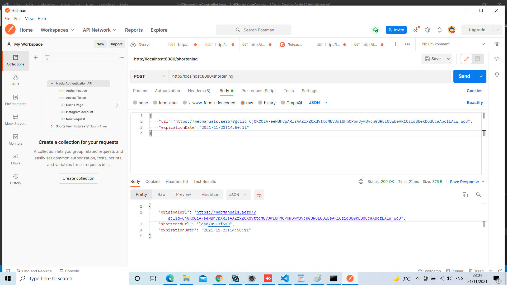
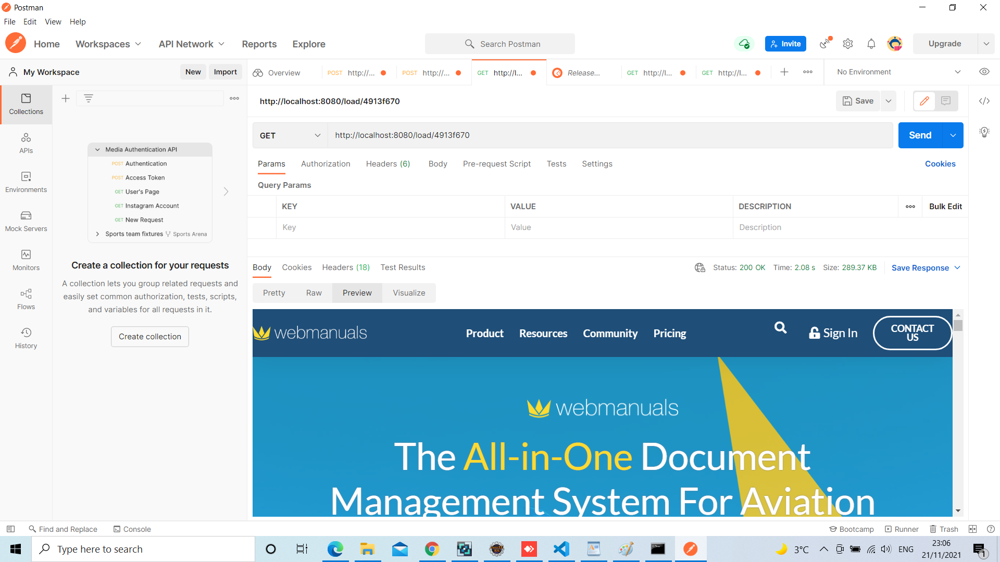

# Url Shortening Service

---

## Description
This project provides an URL shortening service, in addition to entering an expiration date for the shorten URL, you can use the shortened URL many times within the validity date. The project was built by sending the URL and the expiration date by POST JSON, Before sending JSON, it will be checked if the URL and expiration date are valid by JavaScript, when this information is received a shorten URL will be generated by Hashing "UTF_8" and storing originalURL, shortenedURL, creationDate and expirationDate in database, then it will return these stored values, here the first phase of the project is over.

The second phase of the project is by sending the shortened URL by GET JSON, here the request is processed by searching in the database for this shortened URL, we have three cases: the sent shortened URL is wrong, The sent shortened URL is in the database but has expired, or the sent shortened URL is in the database and has not expired, in this case, will be redirected to the original URL that returned from the database. In each wrong case, there will be a message to explain the error for examples " Url does not exist " or " Request Timeout response Url has expired ".

---

## Used Technologies
Project is created with:
- java 11.0.13
- Maven 3.8.3
- Spring Boot  
- Java Script
- CSS
- jquery 3.5.1
- Bootstrap 4.5.2
- h2 database
- google guava version 20 for Hash 

---

## Prerequisites
- Java Development Kit (JDK), version 11 or later.
- Apache Maven, version 3.0 or later.
- H2 Database Engine "Optional" if you want see database.

----

## How-To run

- installed java and maven.
- The project is running by default on port 8080, make sure that port 8080 not busy. 
    note " If you want you can change default port from src\main\resources\application.properties "

### Post JSON On Postman 

### GET ON Postman

### Home Page

### On Click Shorten

### On Click Load

